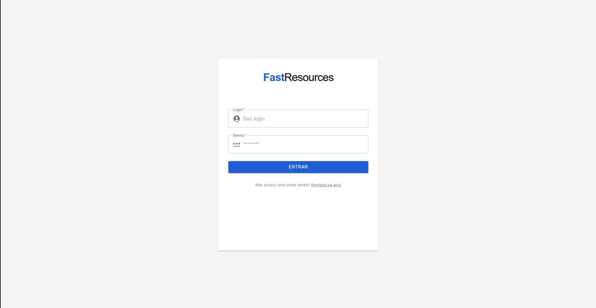
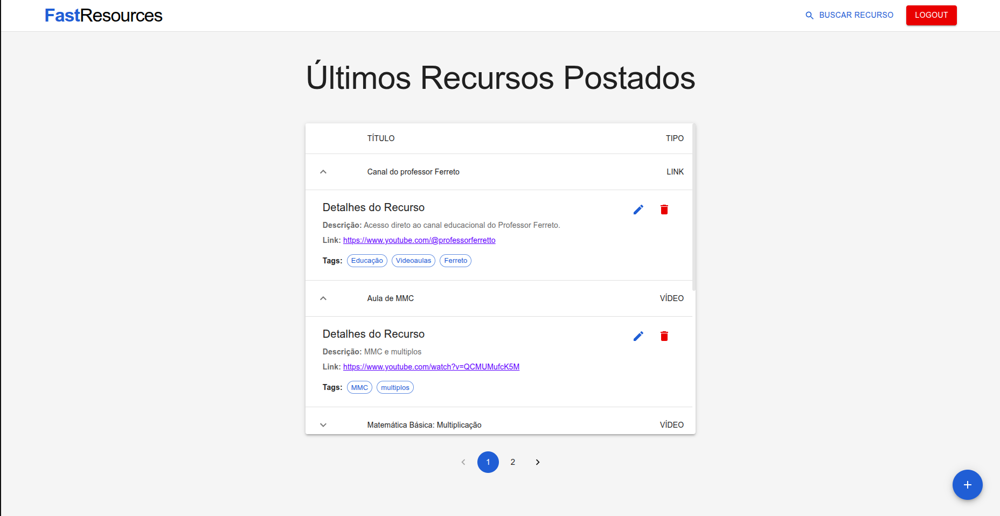
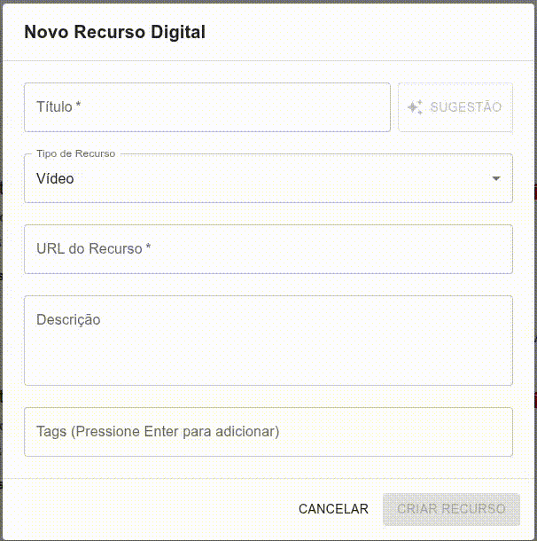
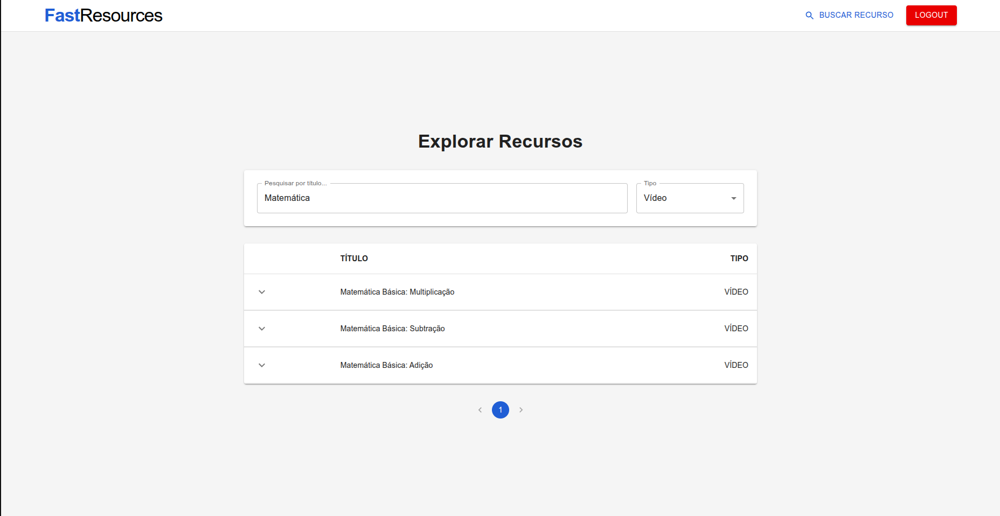

# 🚀 FastResources - Frontend (Web App)

O **FastResources** é uma Single Page Application (SPA) desenvolvida para o gerenciamento inteligente de materiais didáticos. Construída com **React** e **Material UI**, a plataforma oferece uma interface limpa, responsiva e focada na experiência do usuário, permitindo o cadastro de vídeos, PDFs e links com o auxílio de Inteligência Artificial.

[](https://resources-frontend.onrender.com/)
[](https://github.com/Ypisds/resources-backend)


---

## 📸 Interface e Funcionalidades

### 1. Login e Autenticação
Acesso seguro integrado ao backend via **JWT**. O token é armazenado localmente para manter a sessão do usuário ativa durante a navegação pelas rotas protegidas.

<p align="center">
  
</p>

### 2. Dashboard Dinâmico (Listagem e CRUD)
Listagem paginada de recursos utilizando tabelas expansíveis (`Collapse` do Material UI). Cada linha revela detalhes como Descrição, Link e Tags visuais. A interface conta com botões de ação rápida para edição e exclusão de itens.

<p align="center">
  
</p>

### 3. Smart Assist (Integração com IA)
O grande diferencial da plataforma: ao cadastrar ou editar um recurso, o usuário digita apenas o Título e o Tipo, e clica no botão **Sugestão (IA)**. O frontend entra em estado de *loading* e preenche automaticamente a descrição e as tags recomendadas, consumindo a API de LLM do backend.

<p align="center">
  
</p>

### 4. Busca com Filtros:
Além da paginação, o FastResources permite a pesquisa de Recursos com base em filtros como o **nome** e o **tipo** do recurso

<p align="center">
  
</p>

---

## 🎯 Principais Funcionalidades Implementadas

- [x] **Autenticação e Rotas Protegidas:** Uso de React Router Dom para redirecionamento.
- [x] **Smart Assist (IA):** Chamada de API para autocompletar formulários com feedback visual (`CircularProgress`).
- [x] **Busca Avançada com Debounce:** Pesquisa em tempo real otimizada para não sobrecarregar o backend.
- [x] **Gerenciamento de Tags Dinâmicas:** Adição de tags pressionando `Enter` e remoção visual com botões de `Chip` do MUI.
- [x] **Layout Responsivo e Componentizado:** Reutilização de modais (Dialogs) para Criação, Edição e Confirmação de Exclusão.

---

## 📦 Dependências e Stack

O projeto foi inicializado utilizando o **Vite** para um build rápido e otimizado. As principais bibliotecas utilizadas incluem:

* **React (v18):** Biblioteca base para a interface.
* **TypeScript:** Adição de tipagem estática para maior segurança e previsibilidade do código.
* **Material UI (@mui/material & @mui/icons-material):** Biblioteca de componentes para garantir um design system moderno e padronizado.
* **Axios:** Cliente HTTP configurado com interceptadores para envio automático do token JWT.
* **React Router Dom (v6):** Gerenciamento de rotas e navegação da SPA.

---

## 🛠️ Como Executar Localmente

### Pré-requisitos
* **Node.js** (v18 ou superior)
* **NPM** ou **Yarn**
* O backend do [FastResources API](link-para-seu-backend-aqui) deve estar rodando para consumo de dados.

### Instalação

1. **Clone o repositório:**
   ```bash
   git clone [https://github.com/Ypisds/resources-frontend.git](https://github.com/Ypisds/resources-frontend.git)
   cd resources-frontend
   ```
2. **Instale as dependências**:
  ```bash
  npm install
  ```
3. **Configure as variáveis de ambiente localmente**
   Para acessar o backend localmente, coloque a seguinte variável de ambiente no `.env`
   ```
   VITE_API_URL=http://localhost:8000
   ```
4. **Inicie o frontend localmente**:
   ```bash
   npm run dev
   ```
   Acesse a aplicação em `http://localhost:5173`.

## Autor
Feito por **Thiago Brito** para o desafio técnico da VLab
